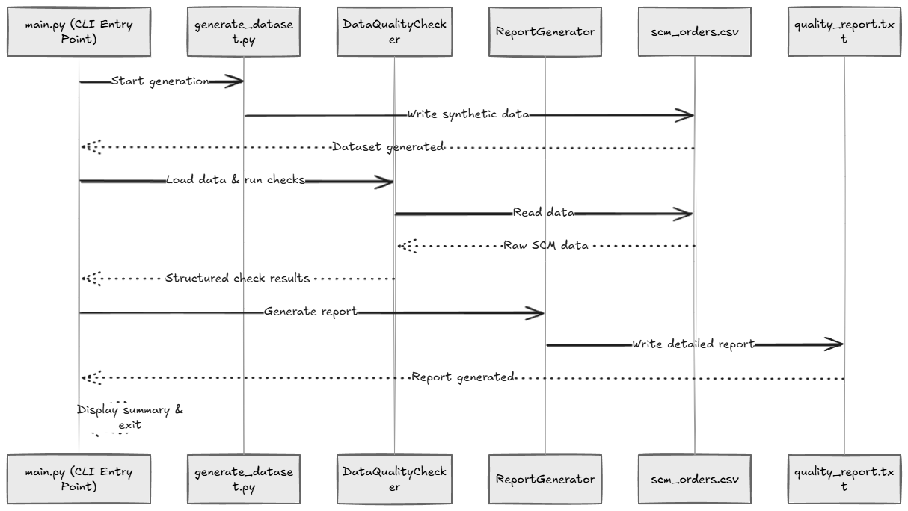
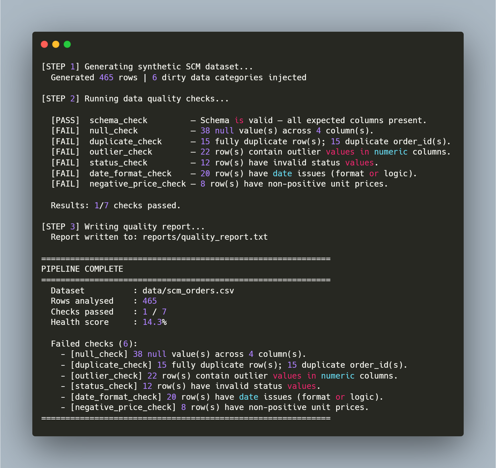

# SCM QA 
# Project 1 — SCM Data Quality Checker

An automated data quality assurance pipeline for supply chain order datasets. The tool generates a realistic synthetic SCM dataset with intentionally injected dirty data, runs seven structured quality checks against it, and produces a plain-text report with per-check findings and corrective recommendations.

Built to demonstrate QA engineering principles in a supply chain context: schema validation, anomaly detection, business rule enforcement, and pipeline resilience.

---

## Problem

Supply chain data pipelines are highly sensitive to data quality issues. A single null supplier field, a duplicate order ID, or a misformatted delivery date can propagate downstream into incorrect inventory forecasts, missed reorder triggers, or broken reporting dashboards. Manual inspection does not scale. This project automates the detection of these issues before they reach production systems.

---

## Approach

The pipeline runs in three sequential stages, each implemented as a separate module.

**Stage 1 — Dataset generation** (`generate_dataset.py`): Produces a ~465-row synthetic CSV of SCM orders with realistic fields covering products, suppliers, regions, warehouses, prices, quantities, order dates, delivery dates, and statuses. Six categories of dirty data are injected deliberately: null values, duplicate rows, quantity and price outliers, invalid status strings, inconsistent date formats, and negative unit prices.

**Stage 2 — Quality checking** (`quality_checker.py`): Defines a `DataQualityChecker` class with seven independent check methods. Each method returns a standardised result dict containing a pass/fail flag, a human-readable summary, a details payload, and the index positions of every affected row. Checks are isolated so a failure in one does not prevent the others from running.

**Stage 3 — Report generation** (`report_generator.py`): Consumes the result dicts and writes a structured plain-text report with a dataset overview, per-check findings, a failed checks summary, and concrete corrective recommendations per failure.

---

## Project Structure

```
project1-data-quality-checker/
├── main.py                  # Pipeline entry point (CLI)
├── generate_dataset.py      # Synthetic SCM dataset generator
├── quality_checker.py       # DataQualityChecker OOP class
├── report_generator.py      # ReportGenerator OOP class
├── requirements.txt         # Python dependencies
├── data/
│   └── scm_orders.csv       # Generated dataset (created on first run)
└── reports/
    └── quality_report.txt   # Output report (created on first run)
```



---

## Quality Checks

| Check | What it detects |
|---|---|
| `schema_check` | Missing or unexpected columns against the expected contract |
| `null_check` | Null and NaN values per column across the entire dataset |
| `duplicate_check` | Fully duplicated rows and duplicate `order_id` values |
| `outlier_check` | Business rule violations and Z-score statistical outliers in `quantity` and `unit_price_eur` |
| `status_check` | Status values outside the valid enum set |
| `date_format_check` | Unparseable dates, mixed format usage, and delivery before order date |
| `negative_price_check` | Non-positive unit prices as a business rule violation |

Every check returns the same structured result dict:

```python
{
    "check":         "null_check",
    "passed":        False,
    "summary":       "38 null value(s) across 4 column(s).",
    "details":       { "total_nulls": 38, "null_by_column": { ... }, "affected_count": 36 },
    "affected_rows": [4, 11, 19, ...],
    "timestamp":     "2025-08-01T14:22:03Z"
}
```

---

## How to Run

**Requirements:** Python 3.10+

Install dependencies:

```bash
pip install -r requirements.txt
```

Run the full pipeline:

```bash
python main.py
```

Skip dataset generation if the CSV already exists:

```bash
python main.py --skip-generate
```

Write the report to a custom path:

```bash
python main.py --report-path reports/my_report.txt
```

Use a custom input dataset:

```bash
python main.py --skip-generate --data-path path/to/your/orders.csv
```

---

## Sample Output

Running `python main.py` produces the following in stdout:

```
[STEP 1] Generating synthetic SCM dataset...
  Generated 465 rows | 6 dirty data categories injected

[STEP 2] Running data quality checks...

  [PASS]  schema_check         — Schema is valid — all expected columns present.
  [FAIL]  null_check           — 38 null value(s) across 4 column(s).
  [FAIL]  duplicate_check      — 15 fully duplicate row(s); 15 duplicate order_id(s).
  [FAIL]  outlier_check        — 22 row(s) contain outlier values in numeric columns.
  [FAIL]  status_check         — 12 row(s) have invalid status values.
  [FAIL]  date_format_check    — 20 row(s) have date issues (format or logic).
  [FAIL]  negative_price_check — 8 row(s) have non-positive unit prices.

  Results: 1/7 checks passed.

[STEP 3] Writing quality report...
  Report written to: reports/quality_report.txt

============================================================
PIPELINE COMPLETE
============================================================
  Dataset          : data/scm_orders.csv
  Rows analysed    : 465
  Checks passed    : 1 / 7
  Health score     : 14.3%

  Failed checks (6):
    - [null_check] 38 null value(s) across 4 column(s).
    - [duplicate_check] 15 fully duplicate row(s); 15 duplicate order_id(s).
    - [outlier_check] 22 row(s) contain outlier values in numeric columns.
    - [status_check] 12 row(s) have invalid status values.
    - [date_format_check] 20 row(s) have date issues (format or logic).
    - [negative_price_check] 8 row(s) have non-positive unit prices.
============================================================
```

The full `quality_report.txt` includes per-check details, affected row indices, and corrective recommendations for each failure.



---

## Error Handling

The pipeline is designed to degrade gracefully rather than crash:

- `load()` raises descriptive errors for missing files, empty CSVs, and malformed input rather than exposing raw pandas tracebacks
- Each check method wraps its logic in a try/except and returns a structured error result dict on failure, so a single broken check does not stop the pipeline
- `run_all()` has a secondary isolation layer around each check call as a last-resort safety net
- Each pipeline step in `main.py` catches specific exception types and exits with a clean message rather than a stack trace
- `KeyboardInterrupt` is caught at the top level so Ctrl+C exits cleanly

---

## Skills Demonstrated

- Object-oriented Python: guard methods, private helpers, single-responsibility classes, and clean separation of concerns across modules
- Automated data quality assurance covering nulls, duplicates, outliers, schema validation, business rule enforcement, and date logic
- Standardised result contracts: every check returns the same dict shape regardless of outcome, making downstream consumption predictable and testable
- Layered exception handling designed for pipeline resilience — individual check failures are recorded, not fatal
- CLI tooling with `argparse` supporting multiple runtime configurations
- Supply chain domain knowledge applied to QA — order IDs, supplier fields, delivery logic, inventory quantities, pricing rules

---

## What I Learned

Designing the result dict contract first — before writing any check logic — made everything downstream significantly simpler. The report generator needed no special casing per check type because every check always returned the same shape. This mirrors how real QA systems work: agreeing on a data contract between components before implementation reduces integration complexity considerably.

The most interesting design problem was `run_all()` isolation. The naive approach crashes the entire pipeline if one check fails unexpectedly. The solution — having each check catch its own exceptions internally and return an error result rather than raising — means the pipeline always completes and the report always reflects the full picture, even when something goes wrong mid-run.

---

## Requirements

```
pandas>=2.0.0
numpy>=1.24.0
```